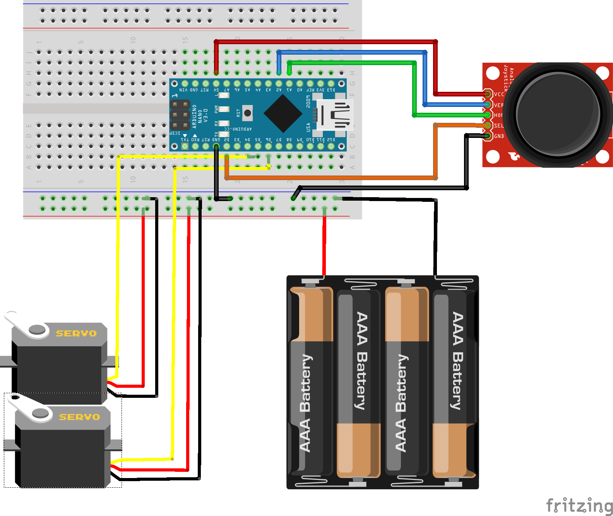
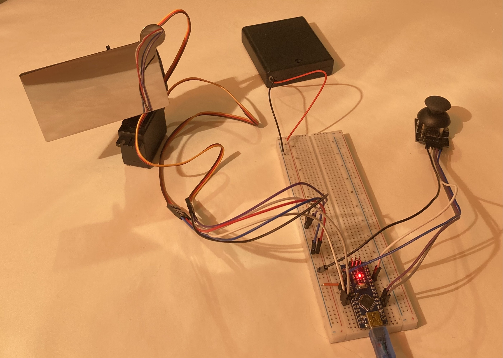
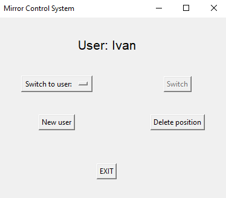

# Mirror Control System

## Project Overview

Mirror Control System is an embedded system for controlling a mirror (or similar device) using a joystick and servo motors. The system combines real-time embedded control with a desktop GUI, enabling both manual and software-driven positioning.

The Arduino firmware processes joystick input, applies filtering and dead-zone logic, and controls servo movement.  
A Python GUI communicates with the system over serial, allowing user-based position management and persistent storage.

---

## System Architecture
```
Joystick → Arduino → Servo Motors
              ↓
            Serial
              ↓
          Python GUI
              ↓
         JSON Storage
```

---

## Folder Structure

```
mirror-control-system/
├── firmware/
│   └── src/
│       └── MirrorControlSystem/
│           └── MirrorControlSystem.ino
├── python/
│   ├── mirrorGUI.py
│   └── users.json
├── images/
│   ├── wiring.png
│   ├── hardware.jpg
│   └── gui.png
├── LICENSE
└── README.md
```

## Arduino Firmware Features

- Joystick input reading (X/Y axes + switch)
- Dead-zone implementation to eliminate unwanted movement
- Analog signal filtering (averaging) for stable input
- Smooth servo movement using incremental steps
- Position boundaries enforcement
- Target-based movement (move to user-defined or central position)
- Auto-sleep mode (servo detach after inactivity)
- Wake-up on user interaction
- EEPROM persistence of last known position
- Automatic restore on system startup
- Serial communication with Python GUI (`INIT`, `SAVE`, `DELETE`)

---

## Python GUI Features

- User management (create, switch, delete users)
- Real-time position synchronization with Arduino
- Sends commands to control mirror position
- Persistent storage using JSON
- Simple and intuitive interface

---

## Hardware Setup

### Wiring Diagram

<p align="center">
  
  <br>
  <em>Figure 1: System wiring diagram</em>
</p>

**Note:**
- Servos are powered from an external battery pack
- Arduino, servos and joystick share a common ground
- Joystick is powered directly from the Arduino

### Components

- Arduino Nano / Uno
- Joystick module
- 2x MG996R servo motors
- Small mirror (reflective surface)
- External battery pack (4x AA rechargeable batteries, 1.2V, 2500mAh each)
- Mounting materials for mechanical assembly


### Pin Configuration

| Component         | Arduino Pin |
|------------------|------------|
| Joystick X (VRx) | A2         |
| Joystick Y (VRy) | A1         |
| Joystick Switch  | D2         |
| Servo X          | D6         |
| Servo Y          | D5         |


### Servo Power Supply

This project uses MG996R high-torque servo motors, which require significantly more current than typical micro servos.

Servos are powered using an external battery pack:
- 4x AA rechargeable batteries (1.2V, 2500mAh each)

**Important:**
- Servos must NOT be powered from the Arduino 5V pin.
- A common ground between the Arduino and the external power supply is required.


### Servo Alignment (Important)

Before assembling the mechanical structure (stacking servos and attaching the mirror), it is important to properly align the servos.

If servos are assembled without calibration, the system may start in an unexpected position and cause:
- sudden movement
- mechanical stress
- potential damage to the mirror or mounting structure

#### Recommended procedure:

1. Upload a simple test program that sets both servos to a known position (e.g. 90°).
2. Power the system and let the servos move to that position.
3. Physically mount the servos and mirror so that this position corresponds to the desired "neutral" orientation.
4. After alignment, upload the main firmware.

#### Note

In this project, custom angle limits were used due to initial misalignment (e.g. 20–40 degrees range).  
Proper mechanical alignment allows using more intuitive and symmetric angle ranges.


### Mechanical Assembly

The system was assembled using simple mounting materials suitable for prototyping.

Servos and the mirror were fixed together using a flexible sealing material, which provided sufficient stability for testing.

For future versions, a rigid mounting structure or custom enclosure would improve mechanical precision and durability.

---

## How to Run

1. Upload the firmware to the Arduino.
2. Connect the Arduino via USB.
3. Set the correct COM port in `mirrorGUI.py`.
4. Run the Python GUI:

```bash
python mirrorGUI.py
```

---

## Design Decisions

### Dead-Zone Handling

Joystick signals are inherently noisy and rarely perfectly centered.  
A dead-zone prevents unintended movement when the joystick is idle.


### Analog Filtering

Multiple ADC readings are averaged to reduce signal noise and stabilize control.


### Smooth Movement

Servo movement is performed incrementally instead of jumping directly to the target, resulting in smoother and more natural motion.


### State-Based Control

The system uses internal flags (`moving`, `isActive`) to separate manual control from automatic positioning.


### Auto Sleep Mode

Servos are detached after a period of inactivity to:
- reduce power consumption
- eliminate jitter
- extend hardware lifespan

---

## Current Status

- Fully functional embedded control system
- Stable joystick input with filtering
- Reliable serial communication with GUI
- Persistent position storage (EEPROM + JSON)
- Smooth and responsive servo control

---

## Future Improvements

- Implement robust serial protocol (ACK, error handling, message validation)
- Improve GUI responsiveness and add visualization features
- Implement automatic joystick calibration at startup
- Migrate firmware to STM32 platform for better performance and control
- Design custom PCB for improved reliability and integration

---

## Demo

### Hardware

<p align="center">
  
</p>

### GUI

<p align="center">
  
</p>

### Video Demo


The video demonstrates full system functionality including user creation, position control, switching between users, and position reset. 

[▶ Watch Demo](https://youtu.be/jPrD__qjtxk)

---

## License

This project is licensed under the terms of the MIT License.

---